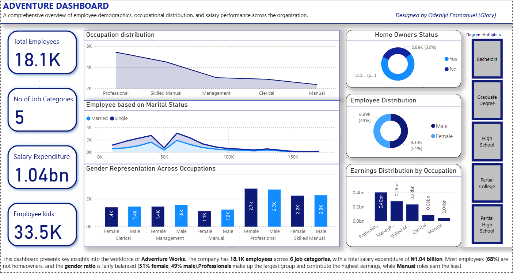

# Adventure Works Workforce & Salary Analytics with PowerBI

## Project Overview
This project features an interactive **Power BI** dashboard built to provide a 360-degree view of the **Adventure Works** workforce. The analysis focuses on employee demographics, marital status, and gender representation across different job categories to help the organization understand its human resource landscape and salary distribution.

## Key Workforce Insights
* **Operational Scale**: Tracks a total of **18.1K employees** distributed across **5 distinct job categories**.
* **Financial Footprint**: Managed a total salary expenditure of **₦1.04 Billion**, with Professionals contributing the highest share of earnings.
* **Demographic Stability**: Identified that **68% of employees are not homeowners**, while the **gender ratio** remains fairly balanced at 51% female and 49% male.
* **Family Impact**: Captured data on **33.5K employee children**, providing insights for potential family-related corporate benefits.
* **Marital Distribution**: Analyzed the correlation between marital status and job categories, identifying patterns in the Professional and Skilled Manual segments.

## Technical Implementation
* **Platform**: Power BI
* **Design Features**: 
    * **KPI Scorecards**: Instant visibility into total headcount and salary spend.
    * **Interactive Degree Slicers**: Allows stakeholders to filter the entire workforce by education level (Bachelors, Graduate Degree, etc.).
    * **Dual-Axis Charts**: For comparing gender representation across different occupations.
* **Branding**: Professionally designed by **Odebiyi Emmanuel (Glory)**.

## Visuals

